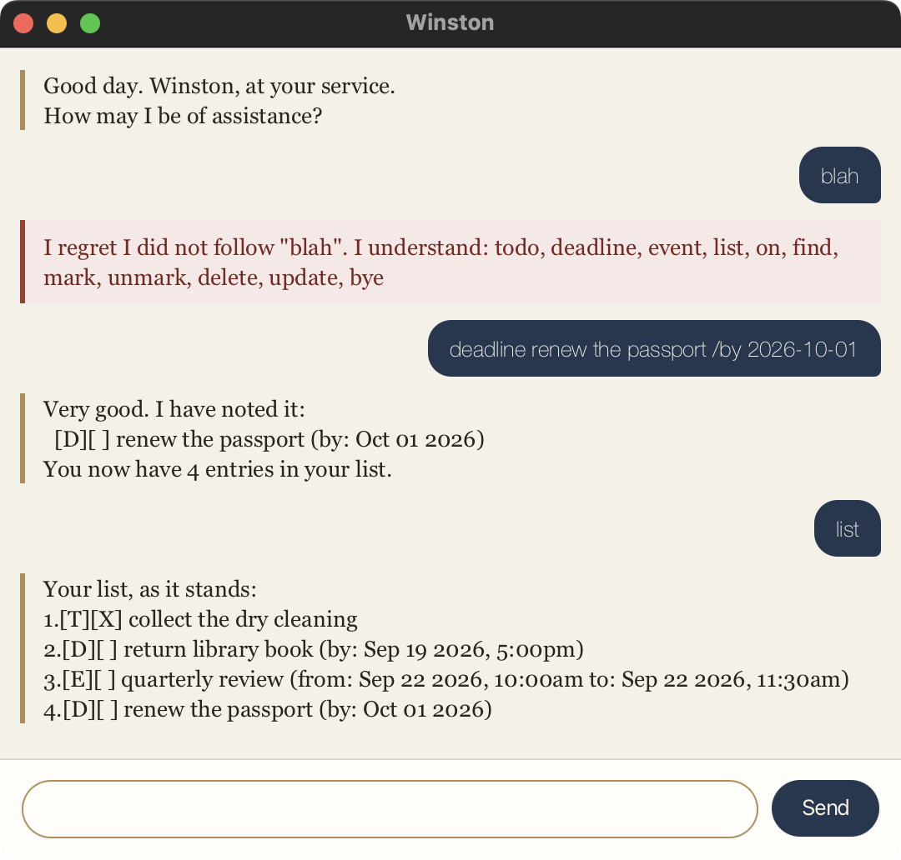

# Winston

Winston is a task tracker with the manner of an unflappable butler. You tell
him what needs doing; he keeps the list, remembers it between sessions, and
never once suggests you are behind.



## Quick start

1. Make sure you have **Java 25** installed.
2. Download `mattchatbot.jar` and put it in a folder of its own.
3. Run it:

   ```
   java -jar mattchatbot.jar
   ```

4. Type a command in the box at the bottom and press Enter.

Winston creates a `data` folder next to the JAR on first use. Nothing to set up.

## Adding things to the list

Winston keeps three kinds of entry.

**A todo** — something to do, with no particular date.

```
todo collect the dry cleaning
```

```
Very good. I have noted it:
  [T][ ] collect the dry cleaning
You now have 1 entry in your list.
```

**A deadline** — something due by a certain time. Put the date after `/by`.

```
deadline return library book /by 2026-09-19 1700
```

```
Very good. I have noted it:
  [D][ ] return library book (by: Sep 19 2026, 5:00pm)
You now have 2 entries in your list.
```

**An event** — something that runs between two times, with `/from` and `/to`.

```
event quarterly review /from 2026-09-22 1000 /to 2026-09-22 1130
```

```
Very good. I have noted it:
  [E][ ] quarterly review (from: Sep 22 2026, 10:00am to: Sep 22 2026, 11:30am)
You now have 3 entries in your list.
```

### Writing dates

Dates go in as `yyyy-MM-dd`, with an optional 24-hour time after a space:

* `2026-09-19` — just the day
* `2026-09-19 1700` — five in the afternoon

Anything else, and Winston will say so rather than guess:

```
I could not make sense of the date "Sunday". It should be written as
yyyy-MM-dd, e.g. 2019-10-15, with a time if you wish, e.g. 2019-10-15 1800.
```

## Looking at the list

**Everything**, numbered:

```
list
```

```
Your list, as it stands:
1.[T][ ] collect the dry cleaning
2.[D][ ] return library book (by: Sep 19 2026, 5:00pm)
3.[E][ ] quarterly review (from: Sep 22 2026, 10:00am to: Sep 22 2026, 11:30am)
```

The two boxes are the kind and the state: `[T]` todo, `[D]` deadline, `[E]` event;
`[X]` done, `[ ]` not yet.

**One particular day.** An event that spans several days shows up on each of them.

```
on 2026-09-22
```

```
Your engagements for Sep 22 2026:
1.[E][ ] quarterly review (from: Sep 22 2026, 10:00am to: Sep 22 2026, 11:30am)
```

**Anything mentioning a word.** Case does not matter, and part of a word will do.

```
find book
```

```
The entries matching your enquiry:
1.[D][ ] return library book (by: Sep 19 2026, 5:00pm)
```

## Changing the list

The number is the one shown by `list`.

**Tick something off**, or put it back:

```
mark 1
```

```
Excellent. I have marked it complete:
  [T][X] collect the dry cleaning
```

```
unmark 1
```

```
Very well. It is outstanding once more:
  [T][ ] collect the dry cleaning
```

**Edit an entry** without retyping it. Name only the parts you want changed —
everything else is left alone, and the entry keeps its place and its tick.

```
update 2 /by 2026-09-26 1700
```

```
Duly amended:
  [D][ ] return library book (by: Sep 26 2026, 5:00pm)
```

You can change the wording, the dates, or both at once:

* `update 2 return the atlas instead` — just the wording
* `update 3 /to 2026-09-22 1200` — just an event's end time
* `update 2 renew the passport /by 2026-10-01` — both at once

Use `/by` for a deadline, and `/from` and `/to` for an event. Winston will
tell you if you reach for the wrong one.

**Remove an entry:**

```
delete 1
```

```
Consider it struck from the list:
  [T][ ] collect the dry cleaning
You now have 2 entries in your list.
```

## Leaving

```
bye
```

```
Very good. I shall be here when you return.
```

The window closes a moment later. Your list is already saved.

## Command summary

| Command | What it does | Example |
| --- | --- | --- |
| `todo <description>` | Adds a task with no date | `todo collect the dry cleaning` |
| `deadline <description> /by <when>` | Adds something due by a time | `deadline return book /by 2026-09-19 1700` |
| `event <description> /from <when> /to <when>` | Adds something that runs between two times | `event review /from 2026-09-22 1000 /to 2026-09-22 1130` |
| `list` | Shows everything, numbered | `list` |
| `on <date>` | Shows what falls on one day | `on 2026-09-22` |
| `find <word>` | Shows entries mentioning a word | `find book` |
| `mark <number>` | Ticks an entry off | `mark 1` |
| `unmark <number>` | Puts it back on the list | `unmark 1` |
| `update <number> [<description>] [/by …] [/from …] [/to …]` | Changes only the parts you name | `update 2 /by 2026-09-26 1700` |
| `delete <number>` | Removes an entry | `delete 1` |
| `bye` | Closes Winston | `bye` |

## Your list is saved for you

Every change is written to `data/mattchatbot.txt` straight away, and read back
the next time you start. There is no save command, and nothing to remember.

If that file is ever damaged — most likely by being edited by hand — Winston
keeps every entry he can still read and tells you exactly which lines he could
not, and why:

```
I was unable to make sense of 2 lines in your saved file, and have set them aside:
  line 2: Expected 3 fields but found 4
  line 4: Unknown task type: X
The entries I could read remain intact.
```

## Three things Winston insists on

**An event must end after it starts.**

```
An event must end after it starts, and this one would run from
Sep 22 2026, 6:00pm to Sep 22 2026, 9:00am.
```

**The same entry cannot be on the list twice.** The same errand on two
different dates is fine — those are two entries, not a repeat.

```
That is already on your list:
  [T][ ] collect the dry cleaning
```

**A description cannot contain `|`.** That character separates the fields of
the save file, so an entry holding one could not be read back.

```
A description cannot contain "|", because that is what separates the fields
of the save file. Please write it another way.
```

## If Winston does not follow you

He will say so, and list what he does understand:

```
I regret I did not follow "blah". I understand: todo, deadline, event, list,
on, find, mark, unmark, delete, update, bye
```

Nothing is lost when a command is refused — the list is left exactly as it was.
